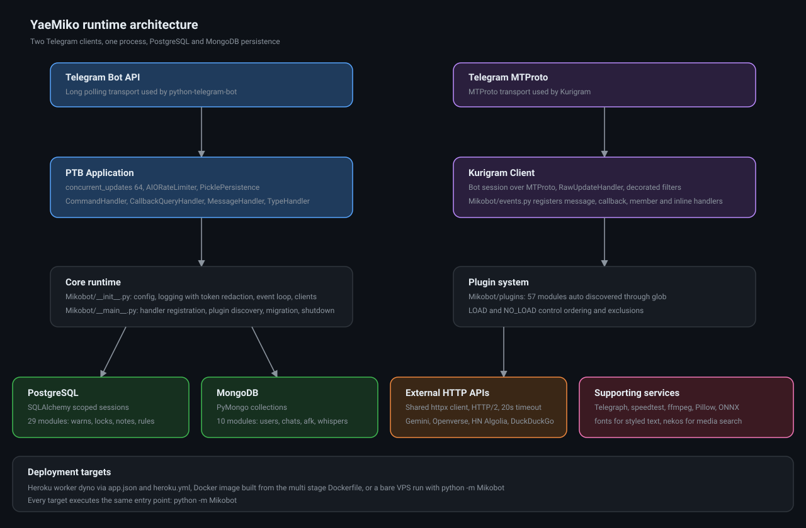
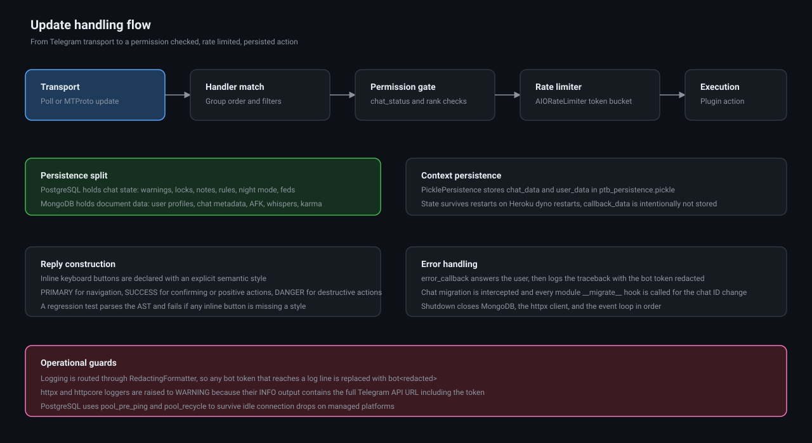

# Architecture

<p align="center">
  <a href="../README.md"></a>
</p>

Back to [README](../README.md).



## Contents

- [Design goals](#design-goals)
- [Process model](#process-model)
- [Core runtime](#core-runtime)
- [PTB application](#ptb-application)
- [Kurigram client](#kurigram-client)
- [Plugin discovery](#plugin-discovery)
- [Update handling](#update-handling)
- [Persistence](#persistence)
- [Localization](#localization)
- [Chat migration](#chat-migration)
- [Shutdown](#shutdown)
- [Error handling](#error-handling)
- [Deployment topologies](#deployment-topologies)

## Design goals

1. One process, two clients. Bot API and MTProto run side by side without a second interpreter.
2. No hardcoded identity. The bot name, username and ID come from `get_me()` at startup.
3. Secrets never reach the log stream. Redaction happens in the formatter, not in call sites.
4. Trimmable without code changes. Plugin selection is configuration, not editing.
5. One entry point everywhere. Heroku, Docker and VPS all run `python -m Mikobot`.

## Process model

A single `asyncio` event loop is created at import time by `_create_event_loop()` in
`Mikobot/__init__.py`. The PTB `Application` is bound to it, the Kurigram `Client` is started on it,
and `run_polling(close_loop=False)` drives updates on it. Shutdown stops the clients, closes the
MongoDB client and the shared httpx client, then closes the loop.

## Core runtime

`Mikobot/__init__.py` performs, in order:

1. `_load_local_env()` reads `.env` from the project root without overwriting real environment
   variables.
2. `env_bool()` normalises booleans and raises on a value that is neither truthy nor falsy, so a
   typo such as `DEL_CMDS=maybe` fails loudly instead of silently becoming `False`.
3. Configuration is resolved: environment when `ENV` is truthy, otherwise `variables.py`.
4. Integer and list variables are validated. An unparsable `OWNER_ID` raises immediately.
5. `RedactingFormatter` is attached to the root logger. The `httpx` and `httpcore` loggers are set
   to `WARNING` because their INFO records embed the full Telegram API URL, including the token.
6. The event loop, the persistence object and the PTB application are built.
7. `get_me()` supplies `BOT_ID`, `BOT_NAME` and `BOT_USERNAME`.
8. The Kurigram `Client` is created and the boot message is sent to the support chat.

### Elevated users

Ranks come from two places and are merged:

| Rank | Environment | `Mikobot/elevated_users.json` key | Capability |
| --- | --- | --- | --- |
| Owner | `OWNER_ID` | n/a | Full control, always added to dragons and devs |
| Dragon | `DRAGONS`, `DEV_USERS` | `sudos` | Admin level bot commands |
| Demon | `DEMONS` | `supports` | Global ban capability |
| Wolf | `WOLVES` | `whitelists` | Cannot be banned |
| Tiger | `TIGERS` | `tigers` | Never bannable by the bot |

## PTB application

```python
persistence = PicklePersistence(
    filepath="ptb_persistence.pickle",
    store_data=PersistenceInput(bot_data=False, chat_data=True, user_data=True, callback_data=False),
)
dispatcher = (
    Application.builder()
    .token(TOKEN)
    .concurrent_updates(64)
    .rate_limiter(AIORateLimiter())
    .persistence(persistence)
    .build()
)
```

`chat_data` and `user_data` are persisted, so moderation state such as the settings button payload
survives a restart. `callback_data` is deliberately not persisted, keeping the pickle small.

## Kurigram client

`Mikobot/events.py` wraps Kurigram handlers so plugins do not need the client argument. Features
that need MTProto, such as fetching a user's profile photo or resolving a peer, register through
these helpers instead of raw handler classes.

## Plugin discovery

`Mikobot/plugins/__init__.py` globs `*.py`, drops `__init__.py`, and applies configuration:

- `LOAD` forces a start order. An unknown name is a fatal error rather than a silent no-op.
- `NO_LOAD` removes modules from the final list.

The resulting list is exported as `ALL_MODULES` and re-exported through `__all__`, which is how
`Mikobot/__main__.py` imports every feature module.

## Update handling



| Stage | Mechanism |
| --- | --- |
| Transport | Long polling on PTB, MTProto socket on Kurigram |
| Handler match | Handler groups and `filters` objects |
| Permission gate | `Mikobot/plugins/helper_funcs/chat_status.py` and the rank sets |
| Rate limiter | `AIORateLimiter` before every outbound Bot API call |
| Execution | Plugin coroutine |
| Reply | Explicitly styled inline buttons |

### Button styling contract

Every inline button call must pass a `style` keyword:

| Style | Meaning | Example |
| --- | --- | --- |
| `KeyboardButtonStyle.PRIMARY` | Navigation and neutral actions | pagination, back, close |
| `KeyboardButtonStyle.SUCCESS` | Confirming and positive actions | confirm, apply, refresh |
| `KeyboardButtonStyle.DANGER` | Destructive actions | delete, ban, purge all |

`tests/test_regressions.py` walks the AST of every Python file and fails when an `InlineKeyboardButton`
or `EqInlineKeyboardButton` call has no `style` keyword, so the contract cannot regress silently.

Note on subclassing: the style is a constructor argument, not a class argument. Declaring
`class EqInlineKeyboardButton(InlineKeyboardButton, style=...)` fails, because Python forwards class
keywords to `__init_subclass__`, which takes no keywords.

## Persistence


| Store | Driver | Contents |
| --- | --- | --- |
| PostgreSQL | SQLAlchemy 2.1, psycopg 3 pooled | Warns, locks, notes, rules, night mode, federation, filters, disabled commands |
| MongoDB | PyMongo 4.18 | Users, chats, AFK, whispers, karma, locale selection, blacklist, fsub, sangmata |
| Pickle file | `PicklePersistence` | PTB `chat_data` and `user_data` |

`Database/sql/__init__.py` rewrites `postgres://` to `postgresql+psycopg://`, creates the engine
with `pool_pre_ping=True` and `pool_recycle=1800`, and calls `BASE.metadata.create_all(engine)`.

## Localization

`Mikobot/utils/localization.py` loads JSON catalogs from `locales/`. `en-US` is enabled, with
`id-ID` and `id-JW` available. The per user and per chat language is stored in MongoDB through
`Database/mongodb/locale_db.py`.

## Chat migration

A `filters.StatusUpdate.MIGRATE` handler in `Mikobot/__main__.py` calls `__migrate__(old, new)` on
every module that defines it, then raises `ApplicationHandlerStop` so no other handler sees the
update. Missing hooks are ignored via `contextlib.suppress`.

## Shutdown

`finally` in `__main__.py` runs a fixed order, each step guarded and logged:

1. `app.stop()` stops the Kurigram client.
2. `close_db()` closes the MongoDB client.
3. `state.aclose()` closes the shared httpx client.
4. The event loop is stopped if still running, then closed.

## Error handling

`error_callback` answers the callback query or the chat with a short notice, then logs the full
traceback through the redacting formatter, so users get feedback and operators get the stack.

## Deployment topologies

| Target | Mechanism |
| --- | --- |
| Heroku worker dyno | `app.json` manifest, `heroku.yml` Docker build, `Procfile` fallback |
| Docker | Two stage build, runtime stage `python:3.14.7-slim` with `ffmpeg`, `curl`, `libgomp1` |
| VPS | Virtual environment, `python -m Mikobot`, tmux or a process supervisor |
