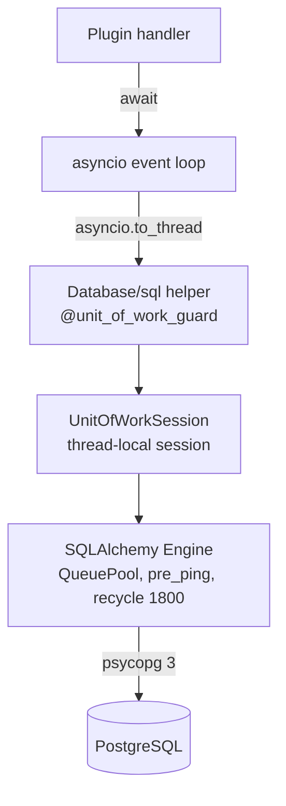
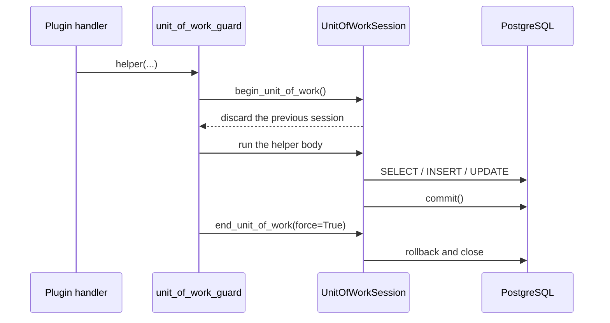
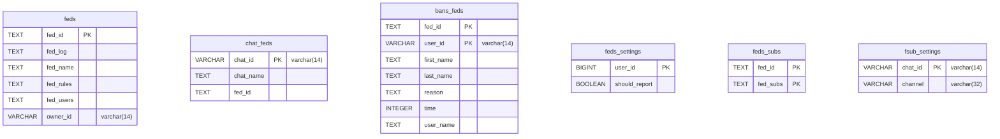
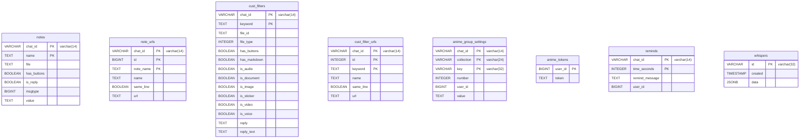
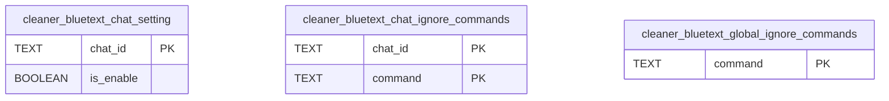
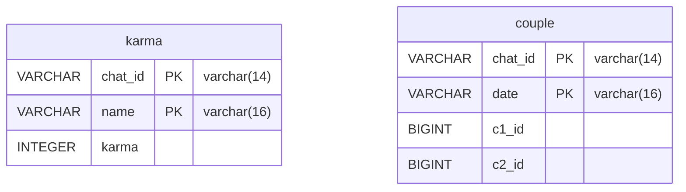
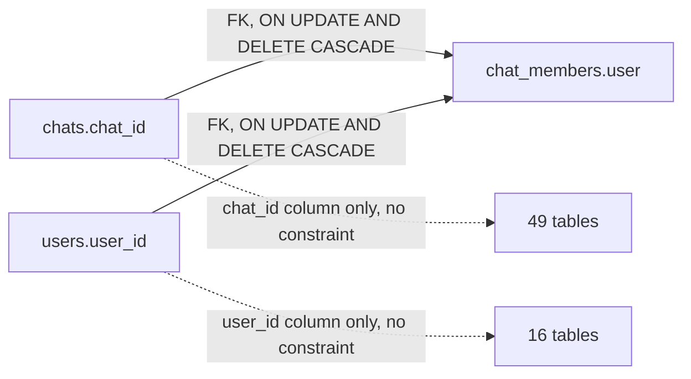

# Database architecture

  

Back to [README](../README.md).

## Contents

- [The one store](#the-one-store)
- [Connection and pool](#connection-and-pool)
- [What a message costs](#what-a-message-costs)
- [Unit of work](#unit-of-work)
- [Module to table map](#module-to-table-map)
- [Domain map](#domain-map)
- [Indexes](#indexes)
- [Identity and directory](#identity-and-directory)
- [Moderation and safety](#moderation-and-safety)
- [Federation and subscriptions](#federation-and-subscriptions)
- [Chat behaviour](#chat-behaviour)
- [Stored content](#stored-content)
- [Service message cleaner](#service-message-cleaner)
- [Karma and couples](#karma-and-couples)
- [Referential integrity](#referential-integrity)
- [Schema evolution](#schema-evolution)

Diagrams are Mermaid and render on GitHub and in VS Code preview.

## The one store

PostgreSQL is the only persistent store. `Database/sql/` holds 31 model modules; 30 of them declare
60 tables and 240 columns, all created by SQLAlchemy 2.1.3 over
psycopg 3. MongoDB was retired once the last plugin moved across; see
[MIGRATION-MONGO-TO-SQL.md](MIGRATION-MONGO-TO-SQL.md). The `Extra/` fonts and the pickle
`DataStore` are files, not tables.

There is no migration tool and no version table. Each model module calls
`__table__.create(bind=ENGINE, checkfirst=True)` for its own tables when it is imported by a
plugin, and that is what creates them: `BASE.metadata.create_all(engine)` runs earlier, inside
`Database/sql/__init__.py`, before any model has registered itself, so it finds an empty
metadata. Adding a column to a table that already exists therefore needs the hand written
`ALTER TABLE` described in [Schema evolution](#schema-evolution).

## Connection and pool

| Setting | Where it comes from | Default |
| --- | --- | --- |
| Connection URL | `DATABASE_URL` through `DB_URI` | required |
| Driver | `postgres://` and `postgresql://` rewritten to `postgresql+psycopg://` in `Database/sql/__init__.py` | psycopg 3 |
| `pool_size` | `DB_POOL_SIZE` | `min(20, cpu * 2 + 4)` |
| `max_overflow` | `DB_MAX_OVERFLOW` | `20` |
| `pool_timeout` | `DB_POOL_TIMEOUT` | `30` seconds |
| `pool_pre_ping` | `DB_PRE_PING` | `True` |
| `pool_recycle` | hard coded | `1800` seconds |
| `client_encoding` | hard coded | `utf8` |
| `statement_timeout` | `DB_STATEMENT_TIMEOUT_MS` | `5000` ms |
| `lock_timeout` | `DB_LOCK_TIMEOUT_MS` | `2000` ms |
| `idle_in_transaction_session_timeout` | `DB_IDLE_IN_TRANSACTION_MS` | `30000` ms |
| `application_name` | hard coded | `yaemiko` |

`pool_pre_ping` costs a round trip on every checkout and the message handlers check
out several times per update, which is why it is switchable; `pool_recycle` already
retires connections before a host drops them. The three timeouts are set through
`connect_args` so a slow query, a contended lock and an abandoned transaction each give
the connection back instead of holding it until `pool_timeout` becomes a `TimeoutError`.

The pool is sized from the worker count because helpers run on `asyncio.to_thread` threads, of
which there can be up to `min(32, cpu + 4)`. The SQLAlchemy default of 5 plus 10 overflow was
reached by one busy chat, after which every further caller waited out `pool_timeout` and raised
`TimeoutError`, which reads as a slow database and is really queueing.

Every statement is counted by shape and the mix is logged every `DB_STATEMENT_LOG_EVERY`
statements. Round trips are what a message path costs, so the query count is the number worth
watching: `top_statements()` returns the same ranking on demand.

## What a message costs

Four handlers are registered for every group message, and each one used to open a unit of
work per lookup. What they touch now:

| Handler | Reads | Cost |
| --- | --- | --- |
| `check_flood` | antiflood limit, timer, clearflood from `CHAT_FLOOD`, `is_approved` | no query unless the approval cache misses |
| `del_blacklist` | blacklist settings and triggers from `CHAT_SETTINGS_BLACKLISTS`, `is_approved` | no query on the usual path |
| `del_lockables` | the `permissions` row, `is_approved` | one query |
| `enforce_gban` | the banned user set from `GBANNED_LIST` | no query unless the user is actually banned |

Two caches do the work. `CHAT_FLOOD` holds `(user_id, count, limit, timer, clearflood)` for
every row of `antiflood`, refreshed by the settings commands and reloaded at startup, so
`get_flood_timer` and `get_clearflood` no longer query a row that was already in memory.
`approve_sql.APPROVED` is a 30 second TTL cache of approval hits; a miss stays a query, so
an approval made by another path is seen rather than remembered as absent.

`locks_sql.PERM_CACHE` holds a `ChatLocks` snapshot per chat, reloaded at startup and
refreshed by `update_lock`, `init_permissions` and `migrate_chat`. An unconfigured chat is
cached as `None`, which is what removed the last per-message query: most groups have no
`permissions` row, so the miss was the common case. The cached value is a dataclass rather
than the ORM row, because a committed row is expired and would try to lazy-load from a
session the helper has already closed.

The per-message handlers reach the database through `asyncio.to_thread`, so a query on a
busy chat occupies a worker thread rather than the event loop.

## Unit of work

Sessions are thread-local and the worker threads are reused, so without a boundary a Session
outlives the call that opened it and a helper that raised would leave staged rows for the next
helper to commit. `unit_of_work_guard` wraps every data helper: it opens a fresh unit of work on
entry and closes it on exit, and `commit()` inside a helper ends that unit of work itself. The
guard runs on the calling thread because a session belongs to the thread that created it.

## Module to table map

| Module | Tables |
| --- | --- |
| `Database/sql/afk_sql.py` | `afk_user` |
| `Database/sql/anime_sql.py` | `anime_group_settings`, `anime_tokens` |
| `Database/sql/antiflood_sql.py` | `antiflood`, `antiflood_settings` |
| `Database/sql/approve_sql.py` | `approval` |
| `Database/sql/blacklist_sql.py` | `blacklist`, `blacklist_settings` |
| `Database/sql/blsticker_sql.py` | `blacklist_stickers`, `blsticker_settings` |
| `Database/sql/bot2bot_sql.py` | `bot_to_bot` |
| `Database/sql/captcha_sql.py` | `captcha_settings`, `captcha_solved` |
| `Database/sql/cleaner_sql.py` | `cleaner_bluetext_chat_ignore_commands`, `cleaner_bluetext_chat_setting`, `cleaner_bluetext_global_ignore_commands` |
| `Database/sql/connection_sql.py` | `access_connection`, `connection`, `connection_history` |
| `Database/sql/cust_filters_sql.py` | `cust_filter_urls`, `cust_filters` |
| `Database/sql/disable_sql.py` | `disabled_commands` |
| `Database/sql/feds_sql.py` | `bans_feds`, `chat_feds`, `feds`, `feds_settings`, `feds_subs` |
| `Database/sql/fsub_sql.py` | `fsub_settings` |
| `Database/sql/global_bans_sql.py` | `gban_settings`, `gbans` |
| `Database/sql/karma_sql.py` | `couple`, `karma` |
| `Database/sql/locale_sql.py` | `chat_locale` |
| `Database/sql/locks_sql.py` | `allowed_items`, `permissions`, `restrictions` |
| `Database/sql/log_channel_sql.py` | `log_channel_setting`, `log_channels` |
| `Database/sql/notes_sql.py` | `note_urls`, `notes` |
| `Database/sql/raid_sql.py` | `raid_chats` |
| `Database/sql/remind_sql.py` | `reminds` |
| `Database/sql/rules_sql.py` | `rules` |
| `Database/sql/sangmata_sql.py` | `sangmata_users` |
| `Database/sql/toggle_sql.py` | `chat_toggles` |
| `Database/sql/topics_sql.py` | `action_topics` |
| `Database/sql/users_sql.py` | `chat_members`, `chats`, `users` |
| `Database/sql/warns_sql.py` | `warn_filters`, `warn_settings`, `warns` |
| `Database/sql/welcome_sql.py` | `clean_service`, `human_checks`, `leave_urls`, `raid_mode`, `welcome_mutes`, `welcome_pref`, `welcome_urls` |
| `Database/sql/whispers_sql.py` | `whispers` |

`fontsql.py` holds the font table used by text-to-image plugins and declares no table.
`userinfo_sql.py` declares none either: it reads `users` and returns the `(name, username)` pair
the ban handlers mention people by.

## Domain map

| Domain | Tables | Example primary keys |
| --- | --- | --- |
| [Identity and directory](#identity-and-directory) | 9 | `users(user_id)`, `chat_members(priv_chat_id)` |
| [Moderation and safety](#moderation-and-safety) | 19 | `warns(user_id, chat_id)`, `blacklist(chat_id, trigger)` |
| [Federation and subscriptions](#federation-and-subscriptions) | 6 | `feds(fed_id)`, `bans_feds(fed_id, user_id)` |
| [Chat behaviour](#chat-behaviour) | 13 | `permissions(chat_id)`, `welcome_pref(chat_id)` |
| [Stored content](#stored-content) | 8 | `notes(chat_id, name)`, `whispers(id)` |
| [Service message cleaner](#service-message-cleaner) | 3 | `cleaner_bluetext_global_ignore_commands(command)` |
| [Karma and couples](#karma-and-couples) | 2 | `karma(chat_id, name)`, `couple(chat_id, date)` |

The key shape is repeated on purpose: almost every table is `(chat_id, ...)` with `chat_id` as `VARCHAR(14)`, and every user keyed table uses a `BIGINT` user id.

## Identity and directory

The two anchor tables and everything that names a user or a chat. `chat_members` is the only table in the schema with declared foreign keys.

```mermaid
erDiagram
    users {
        BIGINT user_id PK
        TEXT username
    }
    chats {
        VARCHAR chat_id PK "varchar(14)"
        TEXT chat_name
    }
    chat_members {
        BIGINT priv_chat_id PK
        VARCHAR chat FK "varchar(14)"
        BIGINT user FK
    }
    sangmata_users {
        BIGINT user_id PK
        TEXT first_name
        TEXT last_name
        TEXT username
    }
    chat_locale {
        VARCHAR chat_id PK "varchar(14)"
        VARCHAR lang "varchar(8)"
    }
    afk_user {
        BIGINT user_id PK
        BOOLEAN is_afk
        TEXT reason
        TIMESTAMP time
    }
    access_connection {
        VARCHAR chat_id PK "varchar(14)"
        BOOLEAN allow_connect_to_chat
    }
    connection {
        BIGINT user_id PK
        VARCHAR chat_id "varchar(14)"
    }
    connection_history {
        VARCHAR chat_id PK "varchar(14)"
        BIGINT user_id PK
        TEXT chat_name
        BIGINT conn_time
    }
```

## Moderation and safety

Bans, filters, flood counters, warns, anti-raid state and the join tables that mark a user as approved, captcha-cleared or verified human.

```mermaid
erDiagram
    gbans {
        BIGINT user_id PK
        TEXT name
        TEXT reason
    }
    gban_settings {
        VARCHAR chat_id PK "varchar(14)"
        BOOLEAN setting
    }
    blacklist {
        VARCHAR chat_id PK "varchar(14)"
        TEXT trigger PK
    }
    blacklist_settings {
        VARCHAR chat_id PK "varchar(14)"
        BIGINT blacklist_type
        BOOLEAN delete_message
        BOOLEAN silent_enabled
        TEXT silent_types
        TEXT value
    }
    blacklist_stickers {
        VARCHAR chat_id PK "varchar(14)"
        TEXT trigger PK
    }
    blsticker_settings {
        VARCHAR chat_id PK "varchar(14)"
        BIGINT blacklist_type
        TEXT value
    }
    antiflood {
        VARCHAR chat_id PK "varchar(14)"
        BOOLEAN clearflood
        BIGINT count
        BIGINT limit
        BIGINT timer
        BIGINT user_id
    }
    antiflood_settings {
        VARCHAR chat_id PK "varchar(14)"
        BIGINT flood_type
        TEXT value
    }
    warns {
        VARCHAR chat_id PK "varchar(14)"
        BIGINT user_id PK
        BIGINT num_warns
        TEXT_ARRAY reasons
    }
    warn_filters {
        VARCHAR chat_id PK "varchar(14)"
        TEXT keyword PK
        TEXT reply
    }
    warn_settings {
        VARCHAR chat_id PK "varchar(14)"
        BOOLEAN soft_warn
        BIGINT warn_limit
    }
    approval {
        VARCHAR chat_id PK "varchar(14)"
        BIGINT user_id PK
    }
    captcha_settings {
        VARCHAR chat_id PK "varchar(14)"
        TEXT button_text
        BOOLEAN enabled
        BOOLEAN kick_enabled
        BIGINT kick_time
        VARCHAR mode "varchar(16)"
        BIGINT mute_time
        BOOLEAN show_rules
    }
    captcha_solved {
        VARCHAR chat_id PK "varchar(14)"
        BIGINT user_id PK
    }
    raid_chats {
        VARCHAR chat_id PK "varchar(14)"
        BIGINT action_time
        BIGINT auto_antiraid
        BOOLEAN notified
        BIGINT raid_time
        BIGINT raid_until
    }
    raid_mode {
        VARCHAR chat_id PK "varchar(14)"
        INTEGER acttime
        BOOLEAN status
        INTEGER time
    }
    human_checks {
        VARCHAR chat_id PK "varchar(14)"
        BIGINT user_id PK
        BOOLEAN human_check
    }
    disabled_commands {
        VARCHAR chat_id PK "varchar(14)"
        TEXT command PK
    }
    action_topics {
        VARCHAR chat_id PK "varchar(14)"
        BIGINT message_thread_id
    }
```

## Federation and subscriptions

Federations, the chats and users inside them, the per-federation ban list and the channel forced-subscription setting.

## Chat behaviour

Locks, welcome and log-channel configuration, rules, disabled features and bot-to-bot modes. One row per chat, keyed on `chat_id`.

```mermaid
erDiagram
    permissions {
        VARCHAR chat_id PK "varchar(14)"
        BOOLEAN audio
        BOOLEAN bots
        BOOLEAN button
        BOOLEAN contact
        BOOLEAN document
        BOOLEAN egame
        BOOLEAN forward
        BOOLEAN game
        BOOLEAN gif
        BOOLEAN inline
        BOOLEAN location
        BOOLEAN photo
        BOOLEAN rtl
        BOOLEAN sticker
        BOOLEAN url
        BOOLEAN video
        BOOLEAN voice
    }
    allowed_items {
        VARCHAR chat_id PK "varchar(14)"
        VARCHAR item PK "varchar(256)"
        VARCHAR lockable PK "varchar(32)"
    }
    restrictions {
        VARCHAR chat_id PK "varchar(14)"
        BOOLEAN media
        BOOLEAN messages
        BOOLEAN other
        BOOLEAN preview
    }
    welcome_pref {
        VARCHAR chat_id PK "varchar(14)"
        BIGINT clean_welcome
        TEXT custom_content
        TEXT custom_leave
        TEXT custom_welcome
        INTEGER leave_type
        BOOLEAN should_goodbye
        BOOLEAN should_welcome
        INTEGER welcome_type
    }
    welcome_urls {
        VARCHAR chat_id PK "varchar(14)"
        INTEGER id PK
        TEXT name
        BOOLEAN same_line
        TEXT url
    }
    leave_urls {
        VARCHAR chat_id PK "varchar(14)"
        INTEGER id PK
        TEXT name
        BOOLEAN same_line
        TEXT url
    }
    welcome_mutes {
        VARCHAR chat_id PK "varchar(14)"
        TEXT welcomemutes
    }
    clean_service {
        VARCHAR chat_id PK "varchar(14)"
        BOOLEAN clean_service
        TEXT service_types
    }
    log_channels {
        VARCHAR chat_id PK "varchar(14)"
        VARCHAR log_channel "varchar(14)"
    }
    log_channel_setting {
        VARCHAR chat_id PK "varchar(14)"
        BOOLEAN log_action
        BOOLEAN log_joins
        BOOLEAN log_leave
        BOOLEAN log_report
        BOOLEAN log_warn
    }
    rules {
        VARCHAR chat_id PK "varchar(14)"
        TEXT rules
    }
    chat_toggles {
        VARCHAR chat_id PK "varchar(14)"
        VARCHAR feature PK "varchar(16)"
        BOOLEAN enabled
    }
    bot_to_bot {
        VARCHAR chat_id PK "varchar(14)"
        VARCHAR allowed
        VARCHAR mode "varchar(16)"
        BOOLEAN skip_review
    }
```

## Stored content

Saved notes, custom filters, anime plugin settings, reminders and the one-shot whisper store.

## Service message cleaner

Per-chat and global ignore lists for the automatic service message deletion.

## Karma and couples

Karma counters per chat and nickname, and the registered couples of a chat.

## Indexes

Primary keys cover lookups by key. Four queries were not one of those, and each had nothing
to fall back on, because `create_all` never adds an index to a table it did not create:

| Index | Serves |
| --- | --- |
| `chat_members_user_idx` | `get_user_num_chats` and `get_user_com_chats`, which filter on the user column alone |
| `users_username_lower_idx` | `get_userid_by_name`, which compares `lower(username)` |
| `notes_name_lower_idx` | `get_note` and `rm_note`, which compare `lower(name)` within a chat |
| `connection_chat_id_idx` | `curr_connection`, where the primary key is the user |

The two functional indexes exist because a function breaks the ordering a b-tree index relies
on, so neither `username` nor `name` is reachable through its own primary key.
`ensure_index()` in `Database/sql/__init__.py` runs `CREATE INDEX IF NOT EXISTS` next to the
table it covers.

## Referential integrity

`chat_members` is the only declared relationship in the schema. Both columns carry
`ForeignKey(..., onupdate="CASCADE", ondelete="CASCADE")` and a unique constraint
`_chat_members_uc` on `(chat, user)`. `ON UPDATE CASCADE` means rewriting `chats.chat_id`
propagates to the membership rows; `users_sql.migrate_chat` still sets them one by one.
`rem_chat` deletes the `chats` row and the membership rows cascade with it.

Everything else is a naming convention: 49 tables carry a `chat_id` column and 16 carry a
`user_id` column, and PostgreSQL enforces none of those links. A setting row can outlive the
chat it belongs to, and `rem_chat` leaves it behind. `log_channel_setting.chat_id` was a `BIGINT` where every other chat key is `VARCHAR(14)`;
it is text now, and a start-up pass widens an existing column. The key types drift with it:

| Table | Column | Declared as | Everywhere else |
| --- | --- | --- | --- |
| `log_channel_setting` | `chat_id` | `BIGINT` | `VARCHAR(14)` |
| `cleaner_bluetext_chat_setting`, `cleaner_bluetext_chat_ignore_commands` | `chat_id` | `TEXT` | `VARCHAR(14)` |
| `bans_feds` | `user_id` | `VARCHAR(14)` | `BIGINT` |
| `feds` | `owner_id` | `VARCHAR(14)` | `BIGINT` |

`feds.fed_id`, `couple.date` and `anime_group_settings.collection` are keys of their own kind,
not chat ids. The four URL tables (`note_urls`, `cust_filter_urls`, `welcome_urls`, `leave_urls`)
put the surrogate `id` inside the composite primary key, so one `id` cannot repeat inside a chat.

## Chat upgrades

Telegram rewrites a chat id when a group becomes a supergroup, so a row keyed on the old id
is orphaned. Every chat keyed module has a `migrate_chat(old, new)`, and the plugin that owns
the data calls it from its `__migrate__` hook. A test asserts that no chat keyed table is left
without one; the only exceptions are the two `cleaner_bluetext_*` tables and `reminds`, whose
modules are imported by no plugin, so nothing writes those rows.

## Schema evolution

`create_all` and `checkfirst=True` create missing tables but never add a column to one that
already exists. Four modules therefore run a column check at import, reading the live column
list first so the pass is idempotent:

| Module | Table | Columns added |
| --- | --- | --- |
| `antiflood_sql.py` | `antiflood` | every column the model declares that the server lacks |
| `blacklist_sql.py` | `blacklist_settings` | same |
| `raid_sql.py` | `raid_chats` | same |
| `welcome_sql.py` | `clean_service` | `service_types` |
| `log_channel_sql.py` | `log_channel_setting` | widens `chat_id` from `BIGINT` to `VARCHAR(14)` |

The first three also write the column default into the rows that were there before, so an
upgraded row reads as the new default instead of NULL.

`cust_filters` is the gap: the `ALTER TABLE` statements that add `reply_text`, `file_type` and
`file_id` are commented out in `cust_filters_sql.py`, so a deployment whose `cust_filters` table
predates those columns keeps the old shape and every read of them fails. A fresh database gets
them from `create_all`, which is why the failure only shows up after an upgrade.

`whispers.id` is `VARCHAR(32)` and not the `VARCHAR(20)` an earlier version declared:
`whispers.py` builds the id with `uuid4().hex`, which PostgreSQL rejects as too long for 20
characters.

